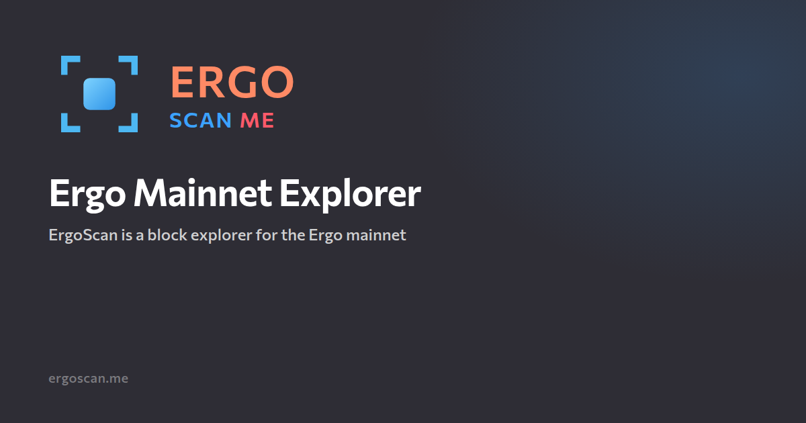

<p align="center">
  <a href="https://ergoscan.me"></a>
</p>

<h1 align="center">ErgoScan</h1>

<p align="center">
  Public Ergo mainnet explorer.<br />
  The first HTML already has the rows. The node is not on the user path.
</p>

<p align="center">
  <a href="https://ergoscan.me"></a>
  <a href="https://api.ergoscan.me/docs"></a>
  <a href="https://ergoscan.me/status"></a>
</p>

**https://ergoscan.me**

ErgoScan is an explorer for Ergo (ERG). It covers blocks, transactions, addresses, tokens, NFTs, the mempool, ErgoDex and Lithos fills, the AgeUSD bank, Rosen bridge events, oracle pools, GORT and DORT buyback, and eUTXO storage rent. The interface is Russian and English. Confirmed data comes from our index. The mempool is live over WebSocket.

It is an index, not a proxy of another explorer and not a façade in front of a node. One Postgres database holds the chain. Pages and the public API read that database. A user GET does not call the node. The only user write is submitting a transaction.

Wallets and dApps use `https://api.ergoscan.me/api/v1/…`. The suffixes match the official explorer API. Explorer pages keep reading `https://ergoscan.me/v1`. GraphQL is `POST /v1/graphql`.

There is no API key and no plan to apply for.

| | |
|---|---|
| Base | `https://api.ergoscan.me/api/v1` — the same router as `/v1` |
| Docs | [api.ergoscan.me/docs](https://api.ergoscan.me/docs) |
| OpenAPI | [api.ergoscan.me/openapi.json](https://api.ergoscan.me/openapi.json) |
| Contract | [`docs/API.md`](./docs/API.md) |
| Reads | 120 / minute / IP |
| Submit | 10 / minute, 2 in flight (REST and GraphQL `submitTx`) |
| Over limit | `429` `{ error: rate_limited, retryAfterSec }` |
| CORS | `*` |
| Amounts | decimal strings |
| Time | unix milliseconds, UTC |
| Pages | keyset `cursor` (`hasMore`, `nextCursor`). Wallet lists also take `limit` ≤ 100 and `offset` ≤ 500 |
| Names | [`kayolo-ergoscan/ergo-names`](https://github.com/kayolo-ergoscan/ergo-names) — open registry of contract names (CC0), `GET /v1/names/book` |

```text
https://ergoscan.me/api/v1/health
https://ergoscan.me/api/v1/epochs/params
https://ergoscan.me/api/v1/tokens/bySymbol/SigUSD
```

Every claim painted on a page has a class: on-chain, rule-decoded, telemetry, live mempool, estimate, or an external source. The same classes are on [`/status`](https://ergoscan.me/status) and [`/learn`](https://ergoscan.me/learn).

Contract names come from the open [ergo-names](https://github.com/kayolo-ergoscan/ergo-names) registry. Projects add their own contracts with a pull request; a merge is the approval, and ErgoScan loads it within the hour.

## Pages

| Open | What it is |
|------|------------|
| [`/`](https://ergoscan.me) | Chain KPIs from the home snapshot. Mempool well is RAM |
| [`/blocks`](https://ergoscan.me/blocks) | Confirmed blocks, newest first |
| [`/transactions`](https://ergoscan.me/transactions) | Confirmed transactions |
| [`/mempool`](https://ergoscan.me/mempool) | Unconfirmed transactions |
| [`/tx`](https://ergoscan.me/transactions) | One transaction: shape, explanation, spent and created boxes, tokens |
| [`/block`](https://ergoscan.me/blocks) | One block |
| [`/box`](https://ergoscan.me/blocks) | One box. Creation height is the storage-rent clock |
| [`/addresses`](https://ergoscan.me/addresses) | Holders with a positive ERG balance |
| [`/address`](https://ergoscan.me/addresses) | One address: balance, tokens, boxes, history, mempool |
| [`/tokens`](https://ergoscan.me/tokens) | Token catalog |
| [`/token`](https://ergoscan.me/tokens) | One token: holders, transfers, swaps, mint and burn |
| [`/nfts`](https://ergoscan.me/nfts) | Gallery of emission-1 tokens. Artwork is read from the index |
| [`/defi`](https://ergoscan.me/defi) | ErgoDex (Spectrum), Lithos, pool cards, AgeUSD bank |
| [`/rosen`](https://ergoscan.me/rosen) | Rosen Event Triggers seen on Ergo |
| [`/oracles`](https://ergoscan.me/oracles) | USD v1, USD v2, and XAU/ERG pools. [GORT](https://ergoscan.me/oracles/xau-erg/gort) and [DORT](https://ergoscan.me/oracles/erg-usd/dort) buyback boxes |
| [`/rent`](https://ergoscan.me/rent) | Storage rent due and collected |
| [`/search`](https://ergoscan.me/search) | Resolve a hash, address, or token name from the index |
| [`/status`](https://ergoscan.me/status) | Public health |
| [`/learn`](https://ergoscan.me/learn) | How to read a claim. [Network](https://ergoscan.me/learn/network) lists public explorers, APIs, and GraphQL endpoints |
| [`/about`](https://ergoscan.me/about) | Who builds ErgoScan |

Transaction shape is one of `fee-collect`, `coinbase`, `reward-unlock`, `transfer`, `token`, `contract`, `script-pay`. Contract means a script was spent. A payment into a script is `script-pay`.

## Stack

Chain rows are stored packed (`packed.*`). Catalogs and snapshots stay in `public.*` (`address_summary`, `tokens`, `token_balances`, `snapshot_kv`). DeFi, Rosen, and oracles have their own schemas.

```
Ergo node
    → indexer              packed chain + public catalogs
    → defi-projector       defi.*     ErgoDex, Lithos, AgeUSD bank
    → rosen-projector      rosen.*    bridge events
    → oracle-projector     oracle.*   three pools + market snapshot
    → rent writer          rent collected
          ↓
       Postgres
          ↑
 gateway     /v1 · /api/v1 · GraphQL · WebSocket
 web         Next.js  →  ergoscan.me
```

The gateway reads Postgres and keeps the mempool in RAM. It does not serve user reads from the node. Submitting a transaction is forwarded to the node.

| Package | Role |
|---------|------|
| `@ergoscan/web` | Next.js UI |
| `@ergoscan/gateway` | REST, GraphQL, WebSocket |
| `@ergoscan/indexer` | Chain and catalogs |
| `@ergoscan/defi-projector` | DEX and AgeUSD bank |
| `@ergoscan/rosen-projector` | Rosen events |
| `@ergoscan/oracle-projector` | Oracle pools and the ERG market snapshot |
| `@ergoscan/shared` | Shapes, rent, labels shared by the apps |

Package names are `@ergoscan/*`. The product name is ErgoScan.

## Develop

```bash
git clone <this repo>
cd ergoscan
npm install
npm run build -w @ergoscan/shared
MOCK=1 npm run dev -w @ergoscan/gateway
npm run dev -w @ergoscan/web
```

Copy `.env.example` and point `DATABASE_URL` and `ERGO_NODE_URL` at your own Postgres and node. `MOCK=1` runs the gateway without a node. Production is `MOCK=0`. Unit files live in `deploy/systemd/`.

## License

Apache License 2.0. See [LICENSE](./LICENSE).
